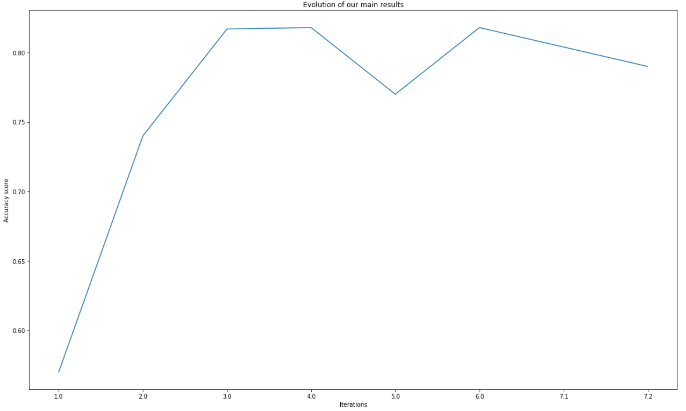

# DM&ML Project: Real or Not NLP with Disaster Tweets 

## Team Blancpain

Gabin FLOURAC,
Sixtine FRANCEY,
Alexandre KEUSEN,

## Objective of the Project 🕵️

Our challenge is to build a Machine Learning Model that aim to predict which tweets are about a real disaster and which are not. 

To do so, we have access to a dataset of 6,471 tweets classified between real disasters (1) and not real disasters (0).

Our results are compared among all teams involved in this competition in order to get the best prediction possible. 

## Project Structure 🚀

### Pre-tasks

- Create new 

### Iteration

Our project has been built around 7 iterations. One for each assumption. For each of these, did  EDA and we tried and enriched our model with different features, further cleaning and using several parameters and classification models.

#### Iteration 1 : Find the base rate

- Load data and create new DataFrames
- Visualize Train/Test Set
- Analyzing Missing values
- Replace NULL values by a non-existing word 
- Target visualization on the Train set 

- **Base Rate : 0.572**

#### Iteration 2 : Working on Keywords

- EDA on Keywords: 
  - Cleaning by grouping similar Keywords (eg. "blew%20up","blown%20up" = "blew%20up")
  - Plot Top 15 Keywords per Target 
  - Plot Most related keywords per target 
- Basic Model: few pre-processing

- **Best score: Logistic Regression - Keyword/Target - TFIDF : 0.74**

#### Iteration 3 : Working on text

- EDA on Text: Evaluated the impact of the two following cleaning on text:
  - Dropped stopwords
  - Removed punctuation

- Bais Model trying preprocessing techniques
- Result: Did not improve the model. Worse, decreased the accuracy by 0.002

- **Best accuracy score: Logistic Regression - text (with stopwords and punctuation) - TFIDF : 0.817 (↗)**

#### Iteration 4 : Working on Keyword + Text
#### Iteration 5 : Workig on Location
#### Iteration 6 : Model and hyperparameters optimization                      
#### Iteration 7 : Unsuccessful tries
##### Iteration 7.1 : Working on Emojis
##### Iteration 7.2 : Working on spelling correction

Step 1: Load and visualize (EDA) 
- import the initial database 
- describe database 
- highlight distribution among features 

Step 2: Base rate of the initial database 

Step 3: Bases benchmark accuracies: train the model on the original dataset without any modification (basic model)
- Text preprocessing
- testing by using "Keyword" feature 
- testing by using Tweeets, "text" feature 
- testing by combining both Keywords and tweets features
--> Startegic conclusion 

Step 4: Improvement of our ML Model: data cleaning 
- Cleaning keywords (text processing)
- Cleaning Tweets (text processing)
--> Interative structure 

Step 5: Development of the modeling 
- logistic regression 
- kNN method 
- decision trees 

Step 6: Results presentation 

## Results 🥇 

- 1st submission: ...
- ...
- ...

## Accuracy evolution Graph

- Iteration 1 : Find the base rate >> Accuracy = 0,57
- Iteration 2 : Working on Keywords >> Accuracy = 0,74
- Iteration 3 : Working on text >> Accuracy = 0,817
- Iteration 4 : Working on Keyword + Text >> Accuracy = 0,818
- Iteration 5 : Workig on Location >> Accuracy = 0,77
- Iteration 6 : Model and hyperparameters optimization >> Accuracy = 0,818                        
- Iteration 7.1 : Working on Emojis >> Accuracy = 0,804
- Iteration 7.2 : Working on spelling correction >> Accuracy = 0,79
