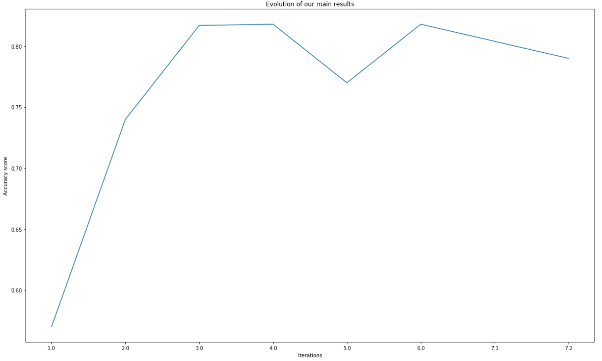

# DM&ML Project: Real or Not NLP with Disaster Tweets 

## Team Blancpain

Gabin FLOURAC,

Sixtine FRANCEY,

Alexandre KEUSEN,

## Objective of the Project 🕵️

Our challenge is to build a Machine Learning Model that aim to predict which tweets are about a real disaster and which are not. 

To do so, we have access to a dataset of 6,471 tweets classified between real disasters (1) and not real disasters (0).

Our results are compared among all teams involved in this competition in order to get the best prediction possible. 

## Find our Notebook: 

sfrancey/Real-o-Not-NPL-with-Disaster-Tweets_Team-Blancpain/Code/Final_Notebook_predict_real_disaster_TeamBlancpain.ipynb

## Project Structure 🚀

### Pre-tasks

- Create new GitHub repository with separated folders (Data, Code, Document) and a ReadMe file
- Create new python notebook with Collab and update it on Github (in Code Folder)
- Importing dataets in GitHub (in Data Folder)
- Complete ReadME file

### Iterations

Our project has been built around 7 iterations. One for each assumption. For each of these, did  EDA and we tried and enriched our model with different features, further cleaning and using several parameters and classification models.

Moreover, we updated the Readme file every week in order to monitor our project activities.

#### Iteration 1 : Find the base rate

- Load data and create new DataFrames
- Visualize Train/Test Set
- Analyzing Missing values
- Replace NULL values by a non-existing word 
- Target visualization on the Train set 

- **Base Rate : 0.572**

#### Iteration 2 : Working on Keywords

- EDA on Keywords: 
  - Cleaning by grouping similar Keywords (eg. "blew%20up","blown%20up" = "blew%20up")
  - Plot *Top 15 Keywords per Target* 
  - Plot *Target Distribution regarding Keywords*
  - Basic Model: few pre-processing

- **Best score: Logistic Regression - Keyword - TFIDF : 0.74**

#### Iteration 3 : Working on Text

  - EDA on Text: Evaluated the impact of the two following cleaning on text:
    - Dropped stopwords
    - Removed punctuation
  
  - Basic Model trying preprocessing technics
  - Result: Did not improve the model. Worse, decreased the accuracy by 0.002

  - **Best accuracy score: Logistic Regression - Text (with stopwords and punctuation) - TFIDF : 0.817 ↗**

#### Iteration 4 : Working on Keywords + Text

  - Further EDA on Keyword: Only consider most related keywords per Target (> 87%)
      → Keyword Selected = 47 out of 210

  - Merged Selected Keyword + Text (cleaned from iteration 3)

  - **Best Accuracy : Logistic Regression - TFIDF : 0.818 ↗**

#### Iteration 5 : Working on Location

  - EDA on Location :
    - Cleaning and Normalizing Location features which appear the most (Top 150)
    - Identify which locations are mainly related to a specific target and which ones are ambiguous
    - Only consider most related Location per Target (> 90%) (Cf. Graph) ⇒ 7 locations

  - Merge Selected Keywords + Text with Locations (Regular vs Selected)

  - **Best Accuracy : kNN (Text + Selected keywords + Selected location) - TFIDF : 0.78 (-)**

#### Iteration 6 : Model and hyperparameters optimization  

  - Model optimization by using cross validation and hyperparameters optimization (SearchGrid) for the following models: 
    - kNN
    - logistic regression
    - random forest
    - decision tree

  - Evaluated models on selected keywords, selected locations and Text (iteration 5), since it was the most accurate features to work with

  - **Best Accuracy : Text + Selected locations + Selected keywords / logistc regression / TF-IDF / C: 3.1622776601683795, max_iter: 100, penalty: 'l2', solver: 'newton-cg' : 0.818**

#### Iteration 7 : Unsuccessful tries

  - Tested more than 100 different models to see which one was the most accurate. We tried the following cleaning:
    - Clean smileys
    - Clean spelling mistakes
    - Remove isolated letters
    - Delete further elements (@, html punctuation, http links)

  - We tried to use only one of these cleaning method each time and applied all models into it (logistic regression/random forest and W2V/TF-IDF) to see the best accuracy.

  - **Best Accuracy : Text + selected keyword + emojis/ logistic regression / TF-IDF : 0.804↘️**

## Results and Accuracy Evolution Graph 🥇

- Iteration 1 : Find the base rate >> Accuracy = **0,57**
- Iteration 2 : Working on Keywords >> Accuracy = **0,74**
- Iteration 3 : Working on text >> Accuracy = **0,817**
- Iteration 4 : Working on Keyword + Text >> Accuracy = **0,818**
- Iteration 5 : Workig on Location >> Accuracy = **0,77**
- Iteration 6 : Model and hyperparameters optimization >> Accuracy = **0,818**                        
- Iteration 7.1 : Working on Emojis >> Accuracy = **0,804**
- Iteration 7.2 : Working on spelling correction >> Accuracy = **0,79**

## Link to the youtube video:
[Here](https://youtu.be/tLXcWtIJMR4)
